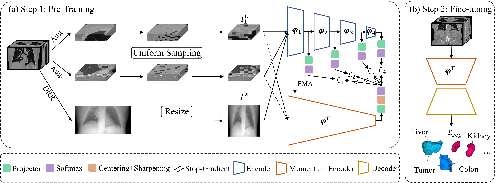

# CADS-code
This is the official pytorch implementation of our TMI paper "CADS: A Self-supervised Learner via Cross-modal Alignment and Deep Self-distillation for CT Volume Segmentation". 

This paper is available [here](https://ieeexplore.ieee.org/document/10605840).


<div align="center">
  
</div>

## Requirements
CUDA 10.1<br />
Python 3.6<br /> 
Pytorch 1.7.1<br /> 
Torchvision 0.8.2<br />


## Usage

### Installation
* Clone this repo.
```
git clone https://github.com/yeerwen/CADS.git
cd CADS
```

### Data Preparation
* Download [DeepLesion dataset](https://nihcc.app.box.com/v/DeepLesion).

### Pre-processing
* Run `DL_save_nifti.py` (from downloaded files) to transfer the PNG image to the nii.gz form.
* Run `re_spacing_ITK.py` to resample CT volumes.
* Run `generate_DRR.py` to generate DRR images.
* Run `splitting_to_patches.py` to extract about 125k sub-volumes, and the pre-processed dataset will be saved in `DL_patches_v2/`.

### Training 
* Run `sh run_ssl.sh` for self-supervised pre-training.

### Pre-trained Model
* Pre-trained model is available in [CADS_PVTb1](https://drive.google.com/file/d/1Jpf9yh6mRvb9mUQHF0iTu6hMPan9lHbU/view?usp=sharing).


### Fine-tune CADS on your own target task

As for the target segmentation tasks, the 3D model can be initialized with the pre-trained encoder using the following example:
```python
import torch
from torch import nn
# build a 3D segmentation model based on resnet50
class PVT_UNet(nn.Module):
    def __init__(self, PVT_encoder, skip_connection, n_class=1, pre_training=True, load_path=None):
        super(PVT_UNet, self).__init__()

        self.PVT = PVT_encoder()
        self.decoder = Decoder(skip_connection)
        self.seg_head = nn.Conv3d(n_class, kernel_size=1)
        
        if pre_training:
            print('loading from checkpoint ssl: {}'.format(load_path))
            w_before = self.PVT.state_dict()['patch_embed1.proj.0.weight'].mean()
            pre_dict = torch.load(pretrain_path, map_location='cpu')['teacher']
            pre_dict = {k.replace("backbone.", ""): v for k, v in pre_dict.items()}
            model_dict = self.PVT.state_dict()
            pre_not = [k for k, v in model_dict.items() if k not in pre_dict]
            print(pre_not)
            pre_dict_update = {k: v for k, v in pre_dict.items() if k in model_dict}
            print("[pre_%d/mod_%d]: %d shared layers" % (len(pre_dict), len(model_dict), len(pre_dict_update)))
            model_dict.update(pre_dict_update)
            self.PVT.load_state_dict(model_dict)
            w_after = self.PVT.state_dict()['patch_embed1.proj.0.weight'].mean()
            print("one-layer before/after: [%.8f, %.8f]" % (w_before, w_after))

        else:
            print("TFS!")

    def forward(self, input):
        outs = self.encoder(input)
        decoder_out = self.deocder(outs)
        out = self.seg_head(decoder_out)
        return out
```


### Citation
If this code is helpful for your study, please cite:

```
@article{yeCADS,
  title={CADS: A Self-supervised Learner via Cross-modal Alignment and Deep Self-distillation for CT Volume Segmentation},
  author={Yiwen Ye, Jianpeng Zhang, Ziyang Chen, and Yong Xia},
  booktitle={IEEE Transactions on Medical Imaging},
  year={2024}
}
```

### Acknowledgements
Part of codes is reused from the [DINO](https://github.com/facebookresearch/dino). Thanks to Caron et al. for the codes of DINO.

### Contact
Yiwen Ye (ywye@mail.nwpu.edu.cn)
